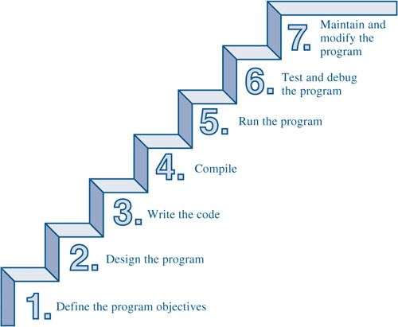
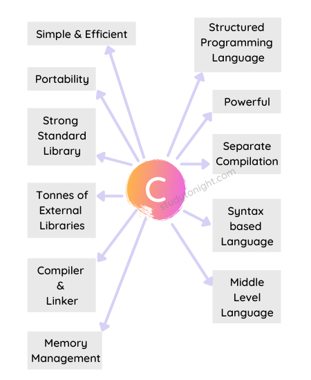

# Introduction ❤️
Wow! This is going to be exciting!

## Welcome

### Summary
- Basic C concepts
- Makefiles
- Variables
- Data types
- Basic operators
- Conditional Statements
- Repeating code
- Arrays
- Functions
- Debugging
- Structs
- Character Strings
- Pointers
- The Preprocessor
- Input and Output
- File Input/Output
- Standard C Library

### Course Outcomes
- I will be able to write beginner C programs.
- I will be able to write efficient, high-quality C code:
  - Modular
  - Low coupling
- I will be able to find and fix my errors:
  - Understanding compiler messages
- I will understand fundamental aspects of C.
- I will have FUN!

## Fundamentals of a Program

### Basics
- **CPU (Central Processing Unit)**
  - Does most of the computing work.
  - Instructions are executed here.
- **RAM (Random Access Memory)**
  - Stores the data of a program while it is running.
- **Hard Drive**
  - Stores source code files.

### High-Level Language
- Easy to write programs.

### Writing a Program

### C Language

## Creating a C Program

##### Editing
- **Description**: Write the source code for your C program using a text editor (e.g., Sublime Text, VSCode).
- **File**: Save the source code in a file with a `.c` extension (e.g., `program.c`).

##### Compiling
- **Description**: Convert the source code into object code using a compiler (e.g., `gcc`).
- **Output**: This generates an object file (e.g., `program.o`).

##### Linking
- **Description**: Combine the object code with libraries to produce an executable file.
- **Output**: This creates an executable file (e.g., `program` or `program.exe`).

##### Executing
- **Description**: Run the executable file to execute the program.
- **Output**: The program performs the tasks defined in the source code and displays the results.  
  
## Compiling and Linking

Compiling a C program is a separate step from linking a C program.

- **Compiling**: This step converts the source code (written in C) into object code. The compiler translates the high-level code into machine code, but at this stage, the code is not yet executable. The result of this step is an object file with a `.o` or `.obj` extension.

- **Linking**: This step takes one or more object files generated by the compiler and combines them with libraries to produce an executable file. The linker resolves references to external symbols and functions, bringing everything together into a final executable program.

### What is a Compiler?
A compiler is a program that translates high-level source code written in a programming language into machine code that can be executed by a computer's CPU.

### What does an IDE (Integrated Development Environment) allow a programmer to do?
- Edit their source code
- Compile their source code
- Run their program
- Debug their program
  
