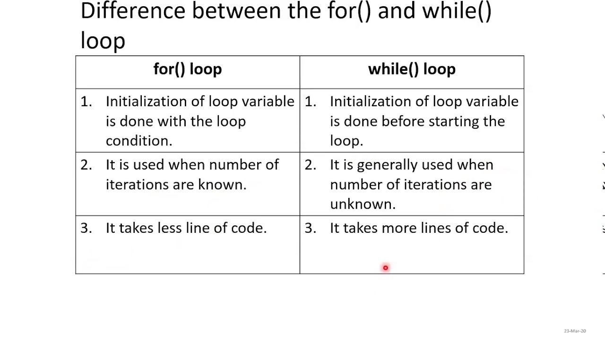

# Control Flow

The statements inside your source files are generally executed from top to bottom, in the order that they appear.

Control flow statements, however, break up the flow of execution by employing decision making, looping, and branching, enabling your program to conditionally execute particular blocks of code:
- Decision-making statements (if-then, if-then-else, switch, goto)
- Looping statements (for, while, do-while)
- Branching statements (break, continue, return)

## Decision Making

Structures require that the programmer specify one or more conditions to be evaluated or tested by the program:
- If a condition is true then a statement or statements are executed.
- If a condition is false then other statements are executed.


### Repeating Code

There may be a situation when you need to execute a block of code several number of times:
- The statements are executed sequentially: The first statement in a function is executed first, followed by the second, and so on.

A loop statement allows us to execute a statement or a group of statements multiple times.

A loop control changes execution from its normal sequence:
- When execution leaves a scope, all automatic objects that were created in that scope are destroyed (break and continue).

A loop becomes an infinite loop if a condition never becomes false:
- The for loop is traditionally used for this purpose.


### LOOPS:


## If Statements

The C programming language provides a general decision-making capability in the form of an if statement:

if ( expression )

*program statement*
- translating a statement such as "if it is raining, then I will go swimming" into the C language is easy  
  
if ( It is not raining)
    
   I will go swimming  
  
The if statement is used to stipulate execution of a program statement/s based upon specified conditions
    
   - I will go swimming if it is not raining  
  
The curly brackets are required for compound statements inside the if block  
    
## Else if 
### example
~~~c  
// Program to implement the sign function  
  
#include <stdio.h>  
  
int main(void)
{ 
    int number, sign;
    
    printf("Please type a number");
    scanf("%d", &number);
    
    if (number < O)
     sign = -1;
    
    else if (number == 0)
    sign = 0;
    
    else 
    sign = 1;
    
    printf(" Sign =%d \n", sign);
    
    return 0
}
~~~
## Nested If-Else statement

A nested if-else statement means you can use one if or else statement inside another if or else if statement(s)
### Nested if statement code example 
if (gameIsOver == O)
    
   if (playerToMove == YOU)
   
   printf("Your Move");
    
  else
    
   printf("My Move");

else printf("The Game is over");

## The conditional Operator (ternary statement)
The conditional operator is a unique operator
    
   - unlike all other operators in C
    
   - most operators are either unary or binary operators
   
   - is a ternary operator (takes Three operands)
    
The two symbols that are used to denote this operator are the (?) and the (:)

The first operand is placed before the ?, the second between the ? and the : and the third after the :

condition ? expression1 : expression2

The conditional operator evaluates to one of two expressions, depending on whether a logical expression evaluates true or false

Notice how the operator is arranged in relation to the operands
- The ? character follows the logical expression, condition
- on the right of ? are two operands, expression1 and 2, that represent choices.
- the value that results from the operation will be the value of expressions1 if condition evaluates to true, or the value of expression2 if condition evaluates to false  

### Example  
  
x = y > Y ? 25 : 50

Results in x being set to 25 if y is greater than Y, or to 50 otherwise  
  
An expression for the maximum or minimum of two variables can be written very simply using the conditional operator

## Switch statement

The conditional operator and the if else statements make it easy to write programs that choose between two alternatives  
  
However, many times a program needs to choose one of severel alternatives
    you can do this using if else if else...
    tedious, prone to errors  
  
when the value of a variable is successively compared against different values use the switch statement
    more convenient and efficient
    
## 3. For Loop
**Definition:**
A `for` loop repeats a block of code a certain number of times.

**Syntax:**
```c
for (initialization; condition; increment) {
    // code to be executed
}
```

**Example:**
```c
#include <stdio.h>

int main() {
    for (int i = 0; i < 5; i++) {
        printf("i = %d\n", i);
    }
    return 0;
}
```

## 4. While and Do-While
**Definition:**
A `while` loop repeats a block of code as long as the condition is true. A `do-while` loop is similar, but it executes the block of code at least once before checking the condition.

**Syntax (while):**
```c
while (condition) {
    // code to be executed
}
```

**Example (while):**
```c
#include <stdio.h>

int main() {
    int i = 0;
    while (i < 5) {
        printf("i = %d\n", i);
        i++;
    }
    return 0;
}
```

**Syntax (do-while):**
```c
do {
    // code to be executed
} while (condition);
```

**Example (do-while):**
```c
#include <stdio.h>

int main() {
    int i = 0;
    do {
        printf("i = %d\n", i);
        i++;
    } while (i < 5);
    return 0;
}
```



## 5. Nested Loops and Loop Control
**Definition:**
Nested loops are loops within loops. Loop control statements (`break`, `continue`) alter the flow of the loop.

**Example (Nested loops):**
```c
#include <stdio.h>

int main() {
    for (int i = 1; i <= 3; i++) {
        for (int j = 1; j <= 3; j++) {
            printf("i = %d, j = %d\n", i, j);
        }
    }
    return 0;
}
```

**Example (Loop control):**
```c
#include <stdio.h>

int main() {
    for (int i = 0; i < 5; i++) {
        if (i == 3) {
            continue; // skip the rest of the loop iteration if i == 3
        }
        if (i == 4) {
            break; // exit the loop if i == 4
        }
        printf("i = %d\n", i);
    }
    return 0;
}
```
    
    


